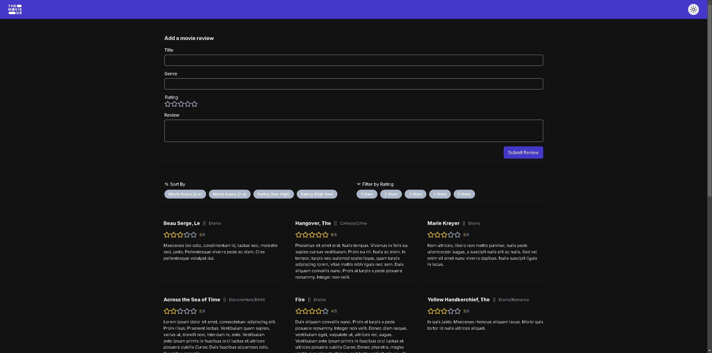

<div align="left">
    
    <div style="display: inline-block;">
        <h2 style="display: inline-block; vertical-align: middle; margin-top: 0;">MOVIE-REVIEW-DB</h2>
        <p>
	<em><code>A full-stack application for tracking and reviewing movies you've watched</code></em>
</p>
        <p>
	
    
    
    

</p>
        <p><!-- default option, no dependency badges. -->
</p>
        <p>
	<!-- default option, no dependency badges. -->
</p>
    </div>
</div>
<br clear="left"/>

## 🔗 Table of Contents

- [📍 Overview](#-overview)
- [👾 Features](#-features)
- [📁 Project Structure](#-project-structure)
  - [📂 Project Index](#-project-index)
- [🚀 Getting Started](#-getting-started)
  - [☑️ Prerequisites](#-prerequisites)
  - [⚙️ Installation](#-installation)
  - [🤖 Usage](#🤖-usage)
- [🔰 Contributing](#-contributing)
- [🎗 License](#-license)

---

## 📍 Overview

Movie-Review-DB is a full-stack web application that allows users to track, rate, and review movies they've watched. The application features a responsive frontend built with React and TypeScript, and a robust backend API built with Node.js and Express. Users can add new movie reviews, filter and sort their movie collection, and manage their watch list with an intuitive interface.

---

## 👾 Features

- Add, edit, and delete movie reviews
- Rate movies with a 5-star rating system
- Filter movies by genre and rating
- Sort movies by title, rating, or date added
- Responsive design that works on desktop and mobile devices
- Dark/light theme toggle
- Persistent data storage
- RESTful API for movie review management

---

## 📁 Project Structure

```sh
└── movie-review-db/
    ├── LICENSE
    ├── README.md
    ├── backend
    │   ├── data
    │   ├── package-lock.json
    │   ├── package.json
    │   ├── src
    │   └── tsconfig.json
    └── frontend
        ├── .gitignore
        ├── eslint.config.js
        ├── index.html
        ├── package-lock.json
        ├── package.json
        ├── src
        ├── tsconfig.app.json
        ├── tsconfig.json
        ├── tsconfig.node.json
        └── vite.config.ts
```

### 📂 Project Index

<details open>
	<summary><b><code>MOVIE-REVIEW-DB/</code></b></summary>
	<details> <!-- __root__ Submodule -->
		<summary><b>__root__</b></summary>
		<blockquote>
			<table>
			</table>
		</blockquote>
	</details>
	<details> <!-- backend Submodule -->
		<summary><b>backend</b></summary>
		<blockquote>
			<table>
			<tr>
				<td><b><a href='https://github.com/donnyjb06/movie-review-db/blob/master/backend/package-lock.json'>package-lock.json</a></b></td>
				<td><code>❯ Dependency lock file for backend</code></td>
			</tr>
			<tr>
				<td><b><a href='https://github.com/donnyjb06/movie-review-db/blob/master/backend/tsconfig.json'>tsconfig.json</a></b></td>
				<td><code>❯ TypeScript configuration for backend</code></td>
			</tr>
			<tr>
				<td><b><a href='https://github.com/donnyjb06/movie-review-db/blob/master/backend/package.json'>package.json</a></b></td>
				<td><code>❯ Backend dependencies and scripts</code></td>
			</tr>
			</table>
			<details>
				<summary><b>src</b></summary>
				<blockquote>
					<table>
					<tr>
						<td><b><a href='https://github.com/donnyjb06/movie-review-db/blob/master/backend/src/server.ts'>server.ts</a></b></td>
						<td><code>❯ Main Express server entry point</code></td>
					</tr>
					</table>
					<details>
						<summary><b>types</b></summary>
						<blockquote>
							<table>
							<tr>
								<td><b><a href='https://github.com/donnyjb06/movie-review-db/blob/master/backend/src/types/review.ts'>review.ts</a></b></td>
								<td><code>❯ TypeScript interfaces for review data</code></td>
							</tr>
							</table>
						</blockquote>
					</details>
					<details>
						<summary><b>config</b></summary>
						<blockquote>
							<table>
							<tr>
								<td><b><a href='https://github.com/donnyjb06/movie-review-db/blob/master/backend/src/config/config.ts'>config.ts</a></b></td>
								<td><code>❯ Server configuration settings</code></td>
							</tr>
							</table>
						</blockquote>
					</details>
					<details>
						<summary><b>controllers</b></summary>
						<blockquote>
							<table>
							<tr>
								<td><b><a href='https://github.com/donnyjb06/movie-review-db/blob/master/backend/src/controllers/review.controller.ts'>review.controller.ts</a></b></td>
								<td><code>❯ Review CRUD operation handlers</code></td>
							</tr>
							</table>
						</blockquote>
					</details>
					<details>
						<summary><b>models</b></summary>
						<blockquote>
							<table>
							<tr>
								<td><b><a href='https://github.com/donnyjb06/movie-review-db/blob/master/backend/src/models/review.model.ts'>review.model.ts</a></b></td>
								<td><code>❯ Data model for movie reviews</code></td>
							</tr>
							</table>
						</blockquote>
					</details>
					<details>
						<summary><b>routes</b></summary>
						<blockquote>
							<table>
							<tr>
								<td><b><a href='https://github.com/donnyjb06/movie-review-db/blob/master/backend/src/routes/review.route.ts'>review.route.ts</a></b></td>
								<td><code>❯ API routes for review endpoints</code></td>
							</tr>
							</table>
						</blockquote>
					</details>
					<details>
						<summary><b>validations</b></summary>
						<blockquote>
							<table>
							<tr>
								<td><b><a href='https://github.com/donnyjb06/movie-review-db/blob/master/backend/src/validations/review.validation.ts'>review.validation.ts</a></b></td>
								<td><code>❯ Input validation for review data</code></td>
							</tr>
							</table>
						</blockquote>
					</details>
				</blockquote>
			</details>
		</blockquote>
	</details>
	<details> <!-- frontend Submodule -->
		<summary><b>frontend</b></summary>
		<blockquote>
			<table>
			<tr>
				<td><b><a href='https://github.com/donnyjb06/movie-review-db/blob/master/frontend/tsconfig.node.json'>tsconfig.node.json</a></b></td>
				<td><code>❯ TypeScript config for Node.js environment</code></td>
			</tr>
			<tr>
				<td><b><a href='https://github.com/donnyjb06/movie-review-db/blob/master/frontend/package-lock.json'>package-lock.json</a></b></td>
				<td><code>❯ Dependency lock file for frontend</code></td>
			</tr>
			<tr>
				<td><b><a href='https://github.com/donnyjb06/movie-review-db/blob/master/frontend/tsconfig.json'>tsconfig.json</a></b></td>
				<td><code>❯ Main TypeScript configuration</code></td>
			</tr>
			<tr>
				<td><b><a href='https://github.com/donnyjb06/movie-review-db/blob/master/frontend/tsconfig.app.json'>tsconfig.app.json</a></b></td>
				<td><code>❯ TypeScript config for application code</code></td>
			</tr>
			<tr>
				<td><b><a href='https://github.com/donnyjb06/movie-review-db/blob/master/frontend/package.json'>package.json</a></b></td>
				<td><code>❯ Frontend dependencies and scripts</code></td>
			</tr>
			<tr>
				<td><b><a href='https://github.com/donnyjb06/movie-review-db/blob/master/frontend/vite.config.ts'>vite.config.ts</a></b></td>
				<td><code>❯ Vite bundler configuration</code></td>
			</tr>
			<tr>
				<td><b><a href='https://github.com/donnyjb06/movie-review-db/blob/master/frontend/index.html'>index.html</a></b></td>
				<td><code>❯ Main HTML entry point</code></td>
			</tr>
			<tr>
				<td><b><a href='https://github.com/donnyjb06/movie-review-db/blob/master/frontend/eslint.config.js'>eslint.config.js</a></b></td>
				<td><code>❯ ESLint code linting configuration</code></td>
			</tr>
			</table>
			<details>
				<summary><b>src</b></summary>
				<blockquote>
					<table>
					<tr>
						<td><b><a href='https://github.com/donnyjb06/movie-review-db/blob/master/frontend/src/App.tsx'>App.tsx</a></b></td>
						<td><code>❯ Main React application component</code></td>
					</tr>
					<tr>
						<td><b><a href='https://github.com/donnyjb06/movie-review-db/blob/master/frontend/src/vite-env.d.ts'>vite-env.d.ts</a></b></td>
						<td><code>❯ Vite environment type definitions</code></td>
					</tr>
					<tr>
						<td><b><a href='https://github.com/donnyjb06/movie-review-db/blob/master/frontend/src/index.tsx'>index.tsx</a></b></td>
						<td><code>❯ React application entry point</code></td>
					</tr>
					</table>
					<details>
						<summary><b>styles</b></summary>
						<blockquote>
							<table>
							<tr>
								<td><b><a href='https://github.com/donnyjb06/movie-review-db/blob/master/frontend/src/styles/index.scss'>index.scss</a></b></td>
								<td><code>❯ Main stylesheet entry point</code></td>
							</tr>
							</table>
							<details>
								<summary><b>utility</b></summary>
								<blockquote>
									<table>
									<tr>
										<td><b><a href='https://github.com/donnyjb06/movie-review-db/blob/master/frontend/src/styles/utility/_reset.scss'>_reset.scss</a></b></td>
										<td><code>❯ CSS reset styles</code></td>
									</tr>
									<tr>
										<td><b><a href='https://github.com/donnyjb06/movie-review-db/blob/master/frontend/src/styles/utility/_functions.scss'>_functions.scss</a></b></td>
										<td><code>❯ SCSS utility functions</code></td>
									</tr>
									<tr>
										<td><b><a href='https://github.com/donnyjb06/movie-review-db/blob/master/frontend/src/styles/utility/_mixins.scss'>_mixins.scss</a></b></td>
										<td><code>❯ SCSS reusable mixins</code></td>
									</tr>
									<tr>
										<td><b><a href='https://github.com/donnyjb06/movie-review-db/blob/master/frontend/src/styles/utility/_variables.scss'>_variables.scss</a></b></td>
										<td><code>❯ SCSS global variables</code></td>
									</tr>
									</table>
								</blockquote>
							</details>
						</blockquote>
					</details>
					<details>
						<summary><b>components</b></summary>
						<blockquote>
							<details>
								<summary><b>ReviewCardGallery</b></summary>
								<blockquote>
									<table>
									<tr>
										<td><b><a href='https://github.com/donnyjb06/movie-review-db/blob/master/frontend/src/components/ReviewCardGallery/ReviewCardGallery.scss'>ReviewCardGallery.scss</a></b></td>
										<td><code>❯ Styles for review card gallery</code></td>
									</tr>
									<tr>
										<td><b><a href='https://github.com/donnyjb06/movie-review-db/blob/master/frontend/src/components/ReviewCardGallery/ReviewCardGallery.tsx'>ReviewCardGallery.tsx</a></b></td>
										<td><code>❯ Grid display of movie review cards</code></td>
									</tr>
									</table>
								</blockquote>
							</details>
							<details>
								<summary><b>Container</b></summary>
								<blockquote>
									<table>
									<tr>
										<td><b><a href='https://github.com/donnyjb06/movie-review-db/blob/master/frontend/src/components/Container/Container.module.scss'>Container.module.scss</a></b></td>
										<td><code>❯ Styles for container component</code></td>
									</tr>
									<tr>
										<td><b><a href='https://github.com/donnyjb06/movie-review-db/blob/master/frontend/src/components/Container/Container.tsx'>Container.tsx</a></b></td>
										<td><code>❯ Layout container component</code></td>
									</tr>
									</table>
								</blockquote>
							</details>
							<details>
								<summary><b>Main</b></summary>
								<blockquote>
									<table>
									<tr>
										<td><b><a href='https://github.com/donnyjb06/movie-review-db/blob/master/frontend/src/components/Main/Main.module.scss'>Main.module.scss</a></b></td>
										<td><code>❯ Styles for main content area</code></td>
									</tr>
									<tr>
										<td><b><a href='https://github.com/donnyjb06/movie-review-db/blob/master/frontend/src/components/Main/Main.tsx'>Main.tsx</a></b></td>
										<td><code>❯ Main content wrapper component</code></td>
									</tr>
									</table>
								</blockquote>
							</details>
							<details>
								<summary><b>ReviewCard.tsx</b></summary>
								<blockquote>
									<table>
									<tr>
										<td><b><a href='https://github.com/donnyjb06/movie-review-db/blob/master/frontend/src/components/ReviewCard.tsx/ReviewCard.tsx'>ReviewCard.tsx</a></b></td>
										<td><code>❯ Individual movie review card</code></td>
									</tr>
									<tr>
										<td><b><a href='https://github.com/donnyjb06/movie-review-db/blob/master/frontend/src/components/ReviewCard.tsx/ReviewCard.scss'>ReviewCard.scss</a></b></td>
										<td><code>❯ Styles for review card</code></td>
									</tr>
									</table>
								</blockquote>
							</details>
							<details>
								<summary><b>StarFormGroup</b></summary>
								<blockquote>
									<table>
									<tr>
										<td><b><a href='https://github.com/donnyjb06/movie-review-db/blob/master/frontend/src/components/StarFormGroup/StarFormGroup.module.scss'>StarFormGroup.module.scss</a></b></td>
										<td><code>❯ Styles for star rating input</code></td>
									</tr>
									<tr>
										<td><b><a href='https://github.com/donnyjb06/movie-review-db/blob/master/frontend/src/components/StarFormGroup/StarFormGroup.tsx'>StarFormGroup.tsx</a></b></td>
										<td><code>❯ Star rating input component</code></td>
									</tr>
									</table>
								</blockquote>
							</details>
							<details>
								<summary><b>SortOrderGroup</b></summary>
								<blockquote>
									<table>
									<tr>
										<td><b><a href='https://github.com/donnyjb06/movie-review-db/blob/master/frontend/src/components/SortOrderGroup/SortOrderGroup.scss'>SortOrderGroup.scss</a></b></td>
										<td><code>❯ Styles for sort controls</code></td>
									</tr>
									<tr>
										<td><b><a href='https://github.com/donnyjb06/movie-review-db/blob/master/frontend/src/components/SortOrderGroup/SortOrderGroup.tsx'>SortOrderGroup.tsx</a></b></td>
										<td><code>❯ Sort order selection component</code></td>
									</tr>
									</table>
								</blockquote>
							</details>
							<details>
								<summary><b>LabeledButtonGroup</b></summary>
								<blockquote>
									<table>
									<tr>
										<td><b><a href='https://github.com/donnyjb06/movie-review-db/blob/master/frontend/src/components/LabeledButtonGroup/LabeledButtonGroup.tsx'>LabeledButtonGroup.tsx</a></b></td>
										<td><code>❯ Button group with label component</code></td>
									</tr>
									</table>
								</blockquote>
							</details>
							<details>
								<summary><b>RoundedButton</b></summary>
								<blockquote>
									<table>
									<tr>
										<td><b><a href='https://github.com/donnyjb06/movie-review-db/blob/master/frontend/src/components/RoundedButton/RoundedButton.tsx'>RoundedButton.tsx</a></b></td>
										<td><code>❯ Reusable rounded button component</code></td>
									</tr>
									</table>
								</blockquote>
							</details>
							<details>
								<summary><b>SortFilterContainer</b></summary>
								<blockquote>
									<table>
									<tr>
										<td><b><a href='https://github.com/donnyjb06/movie-review-db/blob/master/frontend/src/components/SortFilterContainer/SortFilterContainer.tsx'>SortFilterContainer.tsx</a></b></td>
										<td><code>❯ Container for sort and filter controls</code></td>
									</tr>
									<tr>
										<td><b><a href='https://github.com/donnyjb06/movie-review-db/blob/master/frontend/src/components/SortFilterContainer/SortFilterContainer.scss'>SortFilterContainer.scss</a></b></td>
										<td><code>❯ Styles for sort/filter container</code></td>
									</tr>
									</table>
								</blockquote>
							</details>
							<details>
								<summary><b>Header</b></summary>
								<blockquote>
									<table>
									<tr>
										<td><b><a href='https://github.com/donnyjb06/movie-review-db/blob/master/frontend/src/components/Header/Header.module.scss'>Header.module.scss</a></b></td>
										<td><code>❯ Styles for application header</code></td>
									</tr>
									<tr>
										<td><b><a href='https://github.com/donnyjb06/movie-review-db/blob/master/frontend/src/components/Header/Header.tsx'>Header.tsx</a></b></td>
										<td><code>❯ Application header component</code></td>
									</tr>
									</table>
								</blockquote>
							</details>
							<details>
								<summary><b>FilterGroup</b></summary>
								<blockquote>
									<table>
									<tr>
										<td><b><a href='https://github.com/donnyjb06/movie-review-db/blob/master/frontend/src/components/FilterGroup/FilterGroup.tsx'>FilterGroup.tsx</a></b></td>
										<td><code>❯ Movie filtering controls component</code></td>
									</tr>
									<tr>
										<td><b><a href='https://github.com/donnyjb06/movie-review-db/blob/master/frontend/src/components/FilterGroup/FilterGroup.scss'>FilterGroup.scss</a></b></td>
										<td><code>❯ Styles for filter controls</code></td>
									</tr>
									</table>
								</blockquote>
							</details>
							<details>
								<summary><b>Form</b></summary>
								<blockquote>
									<table>
									<tr>
										<td><b><a href='https://github.com/donnyjb06/movie-review-db/blob/master/frontend/src/components/Form/Form.tsx'>Form.tsx</a></b></td>
										<td><code>❯ Movie review form component</code></td>
									</tr>
									<tr>
										<td><b><a href='https://github.com/donnyjb06/movie-review-db/blob/master/frontend/src/components/Form/Form.module.scss'>Form.module.scss</a></b></td>
										<td><code>❯ Styles for review form</code></td>
									</tr>
									</table>
								</blockquote>
							</details>
							<details>
								<summary><b>Star</b></summary>
								<blockquote>
									<table>
									<tr>
										<td><b><a href='https://github.com/donnyjb06/movie-review-db/blob/master/frontend/src/components/Star/Star.tsx'>Star.tsx</a></b></td>
										<td><code>❯ Individual star rating component</code></td>
									</tr>
									</table>
								</blockquote>
							</details>
							<details>
								<summary><b>Input</b></summary>
								<blockquote>
									<table>
									<tr>
										<td><b><a href='https://github.com/donnyjb06/movie-review-db/blob/master/frontend/src/components/Input/InputGroup.tsx'>InputGroup.tsx</a></b></td>
										<td><code>❯ Form input field with label</code></td>
									</tr>
									<tr>
										<td><b><a href='https://github.com/donnyjb06/movie-review-db/blob/master/frontend/src/components/Input/InputGroup.module.scss'>InputGroup.module.scss</a></b></td>
										<td><code>❯ Styles for input group</code></td>
									</tr>
									</table>
								</blockquote>
							</details>
						</blockquote>
					</details>
					<details>
						<summary><b>helpers</b></summary>
						<blockquote>
							<details>
								<summary><b>types</b></summary>
								<blockquote>
									<table>
									<tr>
										<td><b><a href='https://github.com/donnyjb06/movie-review-db/blob/master/frontend/src/helpers/types/FilterSort.ts'>FilterSort.ts</a></b></td>
										<td><code>❯ Filter and sort type definitions</code></td>
									</tr>
									<tr>
										<td><b><a href='https://github.com/donnyjb06/movie-review-db/blob/master/frontend/src/helpers/types/ReviewFormData.ts'>ReviewFormData.ts</a></b></td>
										<td><code>❯ Review form data type definitions</code></td>
									</tr>
									<tr>
										<td><b><a href='https://github.com/donnyjb06/movie-review-db/blob/master/frontend/src/helpers/types/fetchfunction.ts'>fetchfunction.ts</a></b></td>
										<td><code>❯ API fetch function type definitions</code></td>
									</tr>
									<tr>
										<td><b><a href='https://github.com/donnyjb06/movie-review-db/blob/master/frontend/src/helpers/types/review.ts'>review.ts</a></b></td>
										<td><code>❯ Review data type definitions</code></td>
									</tr>
									</table>
								</blockquote>
							</details>
							<details>
								<summary><b>hooks</b></summary>
								<blockquote>
									<table>
									<tr>
										<td><b><a href='https://github.com/donnyjb06/movie-review-db/blob/master/frontend/src/helpers/hooks/useReviewContext.ts'>useReviewContext.ts</a></b></td>
										<td><code>❯ Hook for accessing review context</code></td>
									</tr>
									<tr>
										<td><b><a href='https://github.com/donnyjb06/movie-review-db/blob/master/frontend/src/helpers/hooks/useActiveButton.ts'>useActiveButton.ts</a></b></td>
										<td><code>❯ Hook for button active state</code></td>
									</tr>
									<tr>
										<td><b><a href='https://github.com/donnyjb06/movie-review-db/blob/master/frontend/src/helpers/hooks/useCachedReviews.ts'>useCachedReviews.ts</a></b></td>
										<td><code>❯ Hook for caching review data</code></td>
									</tr>
									<tr>
										<td><b><a href='https://github.com/donnyjb06/movie-review-db/blob/master/frontend/src/helpers/hooks/useFilterSort.ts'>useFilterSort.ts</a></b></td>
										<td><code>❯ Hook for filtering and sorting</code></td>
									</tr>
									<tr>
										<td><b><a href='https://github.com/donnyjb06/movie-review-db/blob/master/frontend/src/helpers/hooks/useThemeContext.ts'>useThemeContext.ts</a></b></td>
										<td><code>❯ Hook for accessing theme context</code></td>
									</tr>
									<tr>
										<td><b><a href='https://github.com/donnyjb06/movie-review-db/blob/master/frontend/src/helpers/hooks/useTheme.ts'>useTheme.ts</a></b></td>
										<td><code>❯ Hook for theme management</code></td>
									</tr>
									<tr>
										<td><b><a href='https://github.com/donnyjb06/movie-review-db/blob/master/frontend/src/helpers/hooks/useQuery.ts'>useQuery.ts</a></b></td>
										<td><code>❯ Hook for API data fetching</code></td>
									</tr>
									</table>
								</blockquote>
							</details>
							<details>
								<summary><b>providers</b></summary>
								<blockquote>
									<table>
									<tr>
										<td><b><a href='https://github.com/donnyjb06/movie-review-db/blob/master/frontend/src/helpers/providers/ReviewProvider.tsx'>ReviewProvider.tsx</a></b></td>
										<td><code>❯ Review data context provider</code></td>
									</tr>
									<tr>
										<td><b><a href='https://github.com/donnyjb06/movie-review-db/blob/master/frontend/src/helpers/providers/ThemeProvider.tsx'>ThemeProvider.tsx</a></b></td>
										<td><code>❯ Theme context provider</code></td>
									</tr>
									</table>
								</blockquote>
							</details>
							<details>
								<summary><b>context</b></summary>
								<blockquote>
									<table>
									<tr>
										<td><b><a href='https://github.com/donnyjb06/movie-review-db/blob/master/frontend/src/helpers/context/ThemeContext.ts'>ThemeContext.ts</a></b></td>
										<td><code>❯ Theme React context definition</code></td>
									</tr>
									<tr>
										<td><b><a href='https://github.com/donnyjb06/movie-review-db/blob/master/frontend/src/helpers/context/ReviewContext.ts'>ReviewContext.ts</a></b></td>
										<td><code>❯ Review data React context definition</code></td>
									</tr>
									</table>
								</blockquote>
							</details>
							<details>
								<summary><b>utils</b></summary>
								<blockquote>
									<table>
									<tr>
										<td><b><a href='https://github.com/donnyjb06/movie-review-db/blob/master/frontend/src/helpers/utils/requestReviews.ts'>requestReviews.ts</a></b></td>
										<td><code>❯ API function to fetch reviews</code></td>
									</tr>
									<tr>
										<td><b><a href='https://github.com/donnyjb06/movie-review-db/blob/master/frontend/src/helpers/utils/deleteReview.ts'>deleteReview.ts</a></b></td>
										<td><code>❯ API function to delete reviews</code></td>
									</tr>
									<tr>
										<td><b><a href='https://github.com/donnyjb06/movie-review-db/blob/master/frontend/src/helpers/utils/themeUtils.ts'>themeUtils.ts</a></b></td>
										<td><code>❯ Theme utility functions</code></td>
									</tr>
									<tr>
										<td><b><a href='https://github.com/donnyjb06/movie-review-db/blob/master/frontend/src/helpers/utils/addNewReview.ts'>addNewReview.ts</a></b></td>
										<td><code>❯ API function to add new reviews</code></td>
									</tr>
									</table>
								</blockquote>
							</details>
						</blockquote>
					</details>
				</blockquote>
			</details>
		</blockquote>
	</details>
</details>

---

## 🚀 Getting Started

### ☑️ Prerequisites

Before getting started with movie-review-db, ensure your runtime environment meets the following requirements:

- **Programming Language:** TypeScript
- **Package Manager:** Npm

### ⚙️ Installation

Install movie-review-db using one of the following methods:

**Build from source:**

1. Clone the movie-review-db repository:

```sh
❯ git clone https://github.com/donnyjb06/movie-review-db
```

2. Navigate to the project directory:

```sh
❯ cd movie-review-db
```

3. Install the project dependencies:

**Using `npm` in both /frontend & backend directories** &nbsp; [](https://www.npmjs.com/)

```sh
❯ npm install
```

4. Navigate to backend directory and compile TypeScript code to Javascript code:

```sh
❯ tsc
```

### 🤖 Usage

1. Run movie-review-db backend server using the following command in the backend directory:
   **Using `npm`** &nbsp; [](https://www.npmjs.com/)

```sh
❯ npm run start
```

1. Run movie-review-db using the following command in the frontend directory:
   **Using `npm`** &nbsp; [](https://www.npmjs.com/)

```sh
❯ npm run dev
```

---

## 🔰 Contributing

- **💬 [Join the Discussions](https://github.com/donnyjb06/movie-review-db/discussions)**: Share your insights, provide feedback, or ask questions.
- **🐛 [Report Issues](https://github.com/donnyjb06/movie-review-db/issues)**: Submit bugs found or log feature requests for the `movie-review-db` project.
- **💡 [Submit Pull Requests](https://github.com/donnyjb06/movie-review-db/blob/main/CONTRIBUTING.md)**: Review open PRs, and submit your own PRs.

<details closed>
<summary>Contributing Guidelines</summary>

1. **Fork the Repository**: Start by forking the project repository to your github account.
2. **Clone Locally**: Clone the forked repository to your local machine using a git client.
   ```sh
   git clone https://github.com/donnyjb06/movie-review-db
   ```
3. **Create a New Branch**: Always work on a new branch, giving it a descriptive name.
   ```sh
   git checkout -b new-feature-x
   ```
4. **Make Your Changes**: Develop and test your changes locally.
5. **Commit Your Changes**: Commit with a clear message describing your updates.
   ```sh
   git commit -m 'Implemented new feature x.'
   ```
6. **Push to github**: Push the changes to your forked repository.
   ```sh
   git push origin new-feature-x
   ```
7. **Submit a Pull Request**: Create a PR against the original project repository. Clearly describe the changes and their motivations.
8. **Review**: Once your PR is reviewed and approved, it will be merged into the main branch. Congratulations on your contribution!
</details>

<details closed>
<summary>Contributor Graph</summary>
<br>
<p align="left">
   <a href="https://github.com{/donnyjb06/movie-review-db/}graphs/contributors">
      
   </a>
</p>
</details>

---

## 🎗 License

This project is protected under the [MIT](https://choosealicense.com/licenses) License. For more details, refer to the [LICENSE](https://choosealicense.com/licenses/) file.

---

## Preview



---
